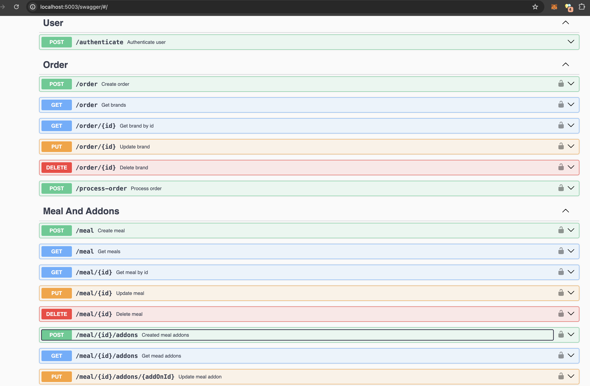
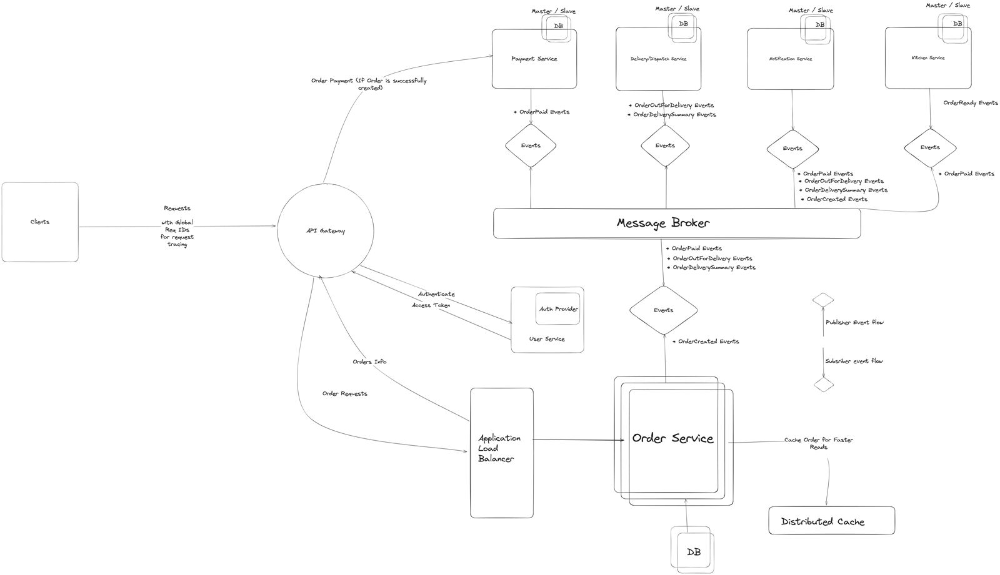

### Set up Instruction 
* Set up a Postgres Database locally. Check [here][link]
* Create .env from .env.example
* Run ```CREATE DATABASE foodcourtdb;``` in the postgres container cli 
* Run ``` yarn ``` to install all modules
* Run ``` yarn create:migration ``` to set database tables
* Run ``` yarn seed:users ``` to seed test users
* Run ``` yarn start:local ``` to run locally
* Visit ``` http://localhost:5003/swagger``` to access API




### Description
The architectural style employed for the  system is a Microservice Architecture. It is a distributed architecture leveraging asynchronous messaging via message brokers for service to service interactions. 

The ordering platform involves developing separate microservices which include Order service, Payment service, Dispatch/Delivery service, Kitchen service,  Notification service and User Service. The requests are coordinated via an API gateway for request routing from the clients. An application load balancer helps manage load and traffic. It sits between the gateway and the application services.




### Components

*Order Service* - This service will manage CRUD operations for orders across the life cycle of the orders. It will be mostly client facing.

*Payment Service* - This service integrates with external payment providers and manages payment information. 

*Kitchen Service* - This service syncs order states for each time and order is completed by external vendors satisfying the order

*Dispatch Service* -  This service manages dispatch rider match based off the proximity to vendor and manages real time delivery updates.

*Notification Service* - This service manages notifications across configured channels such as Push, In-App, Email, Sms etc.

*User Service* - This is service directly integrates with authentication providers to manage token sessions

*API Gateway*

*Application Load Balancer*

*Message Broker*

*Distributed Cache*

*Clients*

*Databases*

 
### Data Storage Handling
 The distributed architecture implores  a database-per-service style in which the databases for each service are set up using a master-slave database architecture. This architecture ensures site reliability which splits responsibilities for both write and read operations in the case of high volumes. A data replication strategy is being deployed to manage consistencies of data from the master nodes to the slave nodes. However, in the case of a failure of the master node - a slave node can be promoted to a master node. Since it is a database-per-service approach, this ensures independent scalability of the services as well. Also, this approach allows easy implementation of the Command-Query Segregation (CQS) since commands handle writes and queries handle reads. SQL databases will be suitable in these cases since most domain data models can be structured and operations are transactional.


### Realtime Order Sync / Data consistency
There is a need to maintain a firm real time syncs and updates for orders and these can be achieved leveraging a publisher-subscriber model across the services - coordinated via the message broker.  Different events are published and subscribed respectively from the different services. For instance, an OrderCreatedEvent is published upon order creation request on the order service which is subscribed on by the Notification service to send notifications across different notification channels as configured perhaps for In-App, Email, Push etc. Also in the event an order was paid for successfully. The Payment Service also publishes an OrderPaidEvent to initiate a series of processes across other services to process the order which sends out notifications as needed for each published event to facilitate a firm real time update to the client. Also, on the code level, choreographic saga pattern can be implemented to facilitate compensating transactions to initiate rollbacks in the case of failures when updating different states across the services. This approach ensures data synchrony across the services. The choreographic approach is suitable since there are a minimal number microservices 


### Caching Implementations
A distributed cache can be used to manage order creations and updates at a high performance before finally being stored in the database. The cache can also store orders that are paid for for faster retrieval from the order service as request by other services and the clients. 

### Resilience and Availability
 High availability is can be maintained as the volume of traffic request increase by either horizontally scaling the order service into multiple instances and thereby load balancing the requests as well as vertically scaling the other services - by adding more CPU resources - since they are mostly subscriber services and are not directly client facing with the traffic. Since the message broker is natively built for high traffic so it will be suitable to manage high traffic. However, it can be clustered as well if need be. Blue/Green deployments strategy should be leveraged for CI/CD processes

### Security
Client authentication can be managed on the user service via the API gateway using JSON web tokens that are very short-lived i.e quick expiration. The signed payload should only contain non sensitive data limited to entity identifiers alone. Also, all databases should be deployed under private domain networks and possibly with factored authentications for external client access. Also application credentials and configuration should level secrets operations toolings for asymmetric encryptions. If card information / private payment data are stored on the payment service, PCI DSS compliance should be maintained at all times for the life cycle of the service.

[link]:https://github.com/rubixnuggets-technologies/Identity-v2
